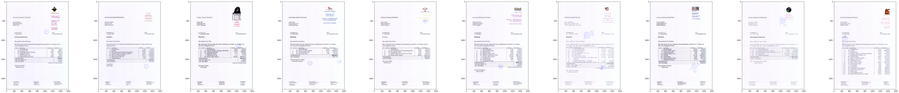

# Segmentation-of-Stamps-in-Documents
## Segment and Parse stamps on documents.

### You are attempting to segment just the stamps from the background text or use OCR techniques to identify the stamped text.

**Author** : SHAILESH DHAMA

An automatic system for stamp segmentation and further verification is needed especially for environments like insurance companies where a huge volume of documents is processed daily. However, detection of a general stamp is not a trivial task as it can have different shapes and colors and, moreover, it can be imprinted with a variable quality and rotation. This dataset was collected to help researchers build such a system.
    
### Dataset:

This dataset contains 400 scanned document images. The documents are automatically generated invoices that were printed, stamped and scanned with 200 dpi resolution. They include color logos and color texts which makes the evaluation results more realistic. There are stamps of many different shapes and colors including black ones in the data set, sometimes the stamps are overlapped with signatures or a text. In some documents there are multiple stamps or none at all. The groundtruth consists of binary images with masks of the stamp strokes which allows for accurate pixel-wise evaluation.
This dataset contains the following folders, each with 400 items (one for each image):

scans: scans of the stamped genuine documents
ground-truth-maps: maps defining the region of the stamp(s)
ground-truth-pixel: pixel-level ground truth
info: contains text files with the info for each file. Each info file contains the following information:
signature [0|1]: signature present [0] or not [1]
textOverlap [0|1]: stamps overlap with printed text [1]
numStamps [0|…|n]: number of stamps on the page
bwStamp[1|…|n]: stamp[1|…|n] is black stamp [1] or colored [1]
    
## Methods:

    ### 1. Importing Libraries :
           -- numpy, pandas,imageio,scikit-learn,scikit-image,cv2,keras,matplotlib,seaborn,glob.

    ### 2. Scanned Image Visualisations:
           -- Read the images from the dataset using matplotlib and imread.
           
    ### 3. Image Segmentation:
           -- Segment and parse the images to extract only the stamps.
           
    ### 4. Modelling
           -- Create a U-net model just to automate the segmentation.
           
## RESULTS :

#### Scanned Image Visualisations


#### Stamp Segmentation Sample


#### Model Creation


#### Model Summary


#### Automated Segmentation Output


### For further information
Please review the narrative of our analysis in [our jupyter notebook](./segmentation-of-stamps-in-documents.ipynb)

For any additional questions, please contact **shaileshettyd@gmail.com)

##### Repository Structure:

```

├── README.md                                               <- The top-level README for reviewers of this project.
├── segmentation-of-stamps-in-documents.ipynb               <- narrative documentation of analysis in jupyter notebook
├── invoice-50.pdf                                          <- Dataset
└── images                                                  <- generated from code

```
## Citing

```
@misc{Shailesh:2020,
  Author = {Shailesh Dhama},
  Title = {Segmentation-of-Stamps-in-Documents},
  Year = {2020},
  Publisher = {GitHub},
  Journal = {GitHub repository},
  Howpublished = {\url{https://https://github.com/ShaileshDhama/Segmentation-of-Stamps-in-Documents}}
}
```
