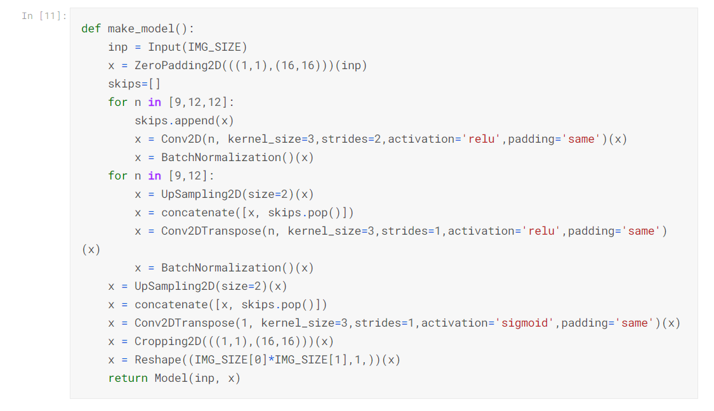

# Segmentation of Stamps in Documents
## Segmenting and Parsing Stamps on Documents

### Introduction
The segmentation of stamps in scanned documents is an essential task for automatic systems used in environments such as insurance companies. A significant amount of documents are processed daily, and the detection of stamps can be challenging due to their varied shapes, colors, and quality. This dataset is designed to assist researchers in developing systems for stamp segmentation and verification.

### Dataset
This dataset contains 400 scanned invoice document images printed, stamped, and scanned at 200 DPI resolution. The images include color logos and texts, making evaluation results more realistic. The dataset includes stamps of different shapes, colors, and qualities, some of which are overlapped with signatures or text. The ground truth for the dataset consists of binary images with masks of the stamp strokes that allow accurate pixel-wise evaluation. The dataset contains the following folders:

* scans: scanned genuine document images with stamps
* ground-truth-maps: maps defining the region of the stamp(s)
* ground-truth-pixel: pixel-level ground truth
* info: contains text files with information about each file, such as signature presence, overlapping of stamps with printed text, the number of stamps on the page, and whether a stamp is black or colored.

### Methods
The following methods were employed in this project:

#### 1. Importing Libraries
We imported the following libraries: numpy, pandas, imageio, scikit-learn, scikit-image, cv2, keras, matplotlib, seaborn, and glob.

#### 2. Scanned Image Visualizations
We read and visualized the scanned images from the dataset using matplotlib and imread.

#### 3. Image Segmentation
We segmented and parsed the images to extract only the stamps from the background text using various techniques.

#### 4. Modelling
We created a U-net model to automate the segmentation of stamps.

### Statistical Formulas
Below are some of the statistical formulas used in this project, written in LaTeX:

#### Mean Absolute Error
Mean Absolute Error (MAE) is a commonly used metric to measure the difference between two continuous variables. It represents the average absolute difference between the predicted and actual values. The formula for calculating MAE is:

$$MAE = \frac{1}{n}\sum_{i=1}^{n}|y_i - \hat{y_i}|$$

where:

- $n$ is the number of observations
- $y_i$ is the actual value of the i-th observation
- $\hat{y_i}$ is the predicted value of the i-th observation

MAE is preferred over other metrics like Mean Squared Error (MSE) because it is less sensitive to outliers, which can have a significant impact on MSE. MAE is typically expressed in the same units as the variable being measured.

### Results
The following are the results of our project:

#### Scanned Image Visualizations


#### Stamp Segmentation Samples


#### Model Creation


#### Model Summary


#### Automated Segmentation Output


### Additional Information
Please review the narrative of our analysis in [our jupyter notebook](./segmentation-of-stamps-in-documents.ipynb).

For any additional questions, please contact **shaileshettyd@gmail.com**.

### Repository Structure
```
├── README.md                                      <- The top-level README for reviewers of this project.
├── segmentation-of-stamps-in-documents.ipynb      <- Narrative documentation of the analysis in Jupyter Notebook
├── invoice-50.pdf                                 <- Dataset
└── images                                         <- Generated from code
```

### Citation
If you find this work useful in your research, please cite:

```
@misc{Shailesh:2020,
  Author = {Shailesh Dhama},
  Title = {Segmentation-of-Stamps-in-Documents},
  Year = {2020},
  Publisher = {GitHub},
  Journal = {GitHub repository},
  Howpublished = {\url{https://https://github.com/ShaileshDhama/Segmentation-of-Stamps-in-Documents}}
}
```
